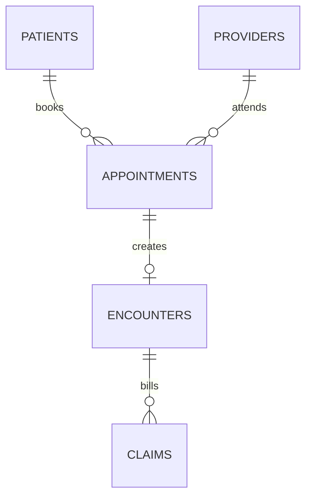

# Mermaid Diagrams

Use Mermaid for every diagram created by this skill.

## Core rule

All diagrams must be Markdown Mermaid blocks. Do not create ASCII diagrams, PlantUML, Graphviz, DBML-only diagrams, screenshots, hand-drawn images, or generated SVG/PNG diagrams as the primary source unless the user explicitly asks for an export format. If an image export is needed, keep the Mermaid source beside it.

This applies to:

- Entity relationship diagrams
- Source relationship maps
- Medallion layer flow diagrams
- dbt DAG summaries
- CI/workflow diagrams
- Metric or semantic-layer diagrams
- Any other process, data, or architecture diagram

## Discovery diagrams

During project discovery, create Mermaid diagrams that help the data engineer understand the source before any build work:

- Create an entity relationship diagram with `erDiagram` when credible relationships exist.
- Create a source inventory or source relationship flow when multiple source tables need a quick visual summary.
- Create a high-level medallion direction diagram when the recommended next path is clearer visually.
- Create a candidate business process flow when the source has an obvious process sequence, such as appointment -> encounter -> claim.

Only include evidence-supported relationships or flows in diagrams. Put uncertain items in notes outside the diagram.

## Entity relationships

For entity relationships, prefer Mermaid `erDiagram`.

Example:



Only include relationships supported by profiling, constraints, source naming, or user-approved business rules. Mark uncertain relationships outside the diagram in notes; do not draw them as confirmed edges.

## Other diagrams

- Use `flowchart TD` or `flowchart LR` for process and medallion flows.
- Use `graph TD` or `graph LR` for simple dependencies.
- Use `sequenceDiagram` only for ordered interactions.
- Keep labels short and readable.
- Quote labels that contain punctuation, parentheses, slashes, or special characters.
- Prefer stable table/model names over long descriptions inside nodes.

## Visibility verification

Before marking a phase complete, verify every Mermaid diagram added or changed is visible and parseable.

Preferred checks:

1. Render the Markdown in the target viewer when available and visually confirm the diagram is not blank, clipped, or unreadable.
2. For standalone Mermaid files or important diagrams, render with Mermaid CLI when available:

```powershell
npx -y @mermaid-js/mermaid-cli -i <diagram-or-markdown-file> -o <output.svg>
```

3. If rendering is not available, at minimum inspect the Mermaid block for:
   - Opening fence is exactly ```` ```mermaid ````.
   - Closing fence exists.
   - Diagram type is valid, such as `erDiagram`, `flowchart TD`, or `graph LR`.
   - Node/table identifiers contain no spaces or unsupported punctuation.
   - Relationship syntax is valid for the diagram type.

Record the verification result in the phase report.

Use full wording in diagram titles, notes, and phase reports. For example, write `entity relationship diagram`, not the abbreviation.

## Report requirement

When a phase includes diagrams, the phase report must list:

- Diagram file or section
- Diagram type
- What it represents
- Visibility/parse verification result
- Any relationships intentionally omitted because they are not proven
